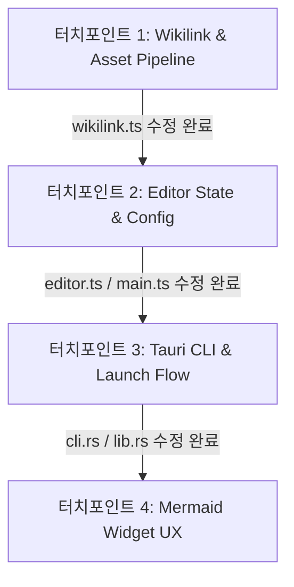

# mermark 수렴형 통합 로드맵 (ROADMAP)

이 문서는 **mermark**의 단일 파일 CLI 에디터 정체성을 유지하면서 사용성을 극대화하기 위해 수렴성 필터링(Scope Guard & ROI)과 최단루트 순차 통합 분석을 거쳐 확정한 최종 로드맵입니다.

---

## 📅 1. 단계별 마일스톤 (Milestones)

### Phase 1: 핵심 CLI, 내비게이션 & 안전성 (5개 과제, $N_1 = 5$)
*가장 핵심적인 마찰(Friction)들을 제거하고 키보드 중심의 개발자 사용성을 확보합니다.*

1.  **1-1. CLI 실행 시 파일 자동 생성 (Vim 스타일)**
    *   *내용*: 존재하지 않는 파일명을 CLI 인자로 넘겨도 즉시 빈 파일을 디스크에 생성하고 에디터 창을 켬.
    *   *대상*: `cli.rs`
2.  **1-2. 미존재 위키링크 클릭 시 디렉토리/파일 자동 생성**
    *   *내용*: `[[subdir/new_file]]` 클릭 시 하위 경로 폴더를 `create_dir_all`로 자동 생성 후 신규 파일 생성 및 열기.
    *   *대상*: `wikilink.ts` + Tauri commands
3.  **1-3. 외부 충돌 발생 시 "디스크에서 다시 읽기" 지원**
    *   *내용*: 파일 저장 충돌 시, 덮어쓰지 않고 에디터를 새로고침하여 디스크 변경 사항을 즉시 반영하는 옵션 제공.
    *   *대상*: `main.ts` + `editor.ts`
4.  **1-4. 일반 자산(PDF, 이미지) 연동 프로그램 실행**
    *   *내용*: 위키링크 클릭 대상이 마크다운(`.md`)이 아닌 경우, Tauri 창 대신 OS 기본 뷰어로 열기.
    *   *대상*: `wikilink.ts` + `tauri-plugin-opener`
5.  **1-5. Vim 키바인딩 모드 탑재**
    *   *내용*: 키보드 중심 에디팅을 위해 CodeMirror 6의 Vim 모드 플러그인 연동 및 설정 토글 추가.
    *   *대상*: `editor.ts` + settings UI

### Phase 2: 고급 CLI & AI 컨텍스트 (3개 과제, $N_2 = 3$)
*터미널 파이프라인 및 LLM에 컨텍스트를 주입하기 위한 특화 기능을 확장합니다.*

6.  **2-1. CLI 표준 입력(Stdin) 파이프 지원**
    *   *내용*: `cat doc.md | mermark -` 처리. 백엔드에서 stdin을 임시 스크래치 파일에 기록 후 켬.
    *   *대상*: `lib.rs` / `main.rs`
7.  **2-2. LLM 컨텍스트 패키저 및 bundle CLI**
    *   *내용*: 연관 위키링크 문서를 XML/Markdown 복합 텍스트로 합쳐주는 클립보드 복사 단축키 및 `mermark bundle` 커맨드 추가.
    *   *대상*: `cli.rs` + frontend UI
8.  **2-3. Mermaid 줌 상태 시각적 제어 및 초기화**
    *   *내용*: 줌/팬 적용 시 원래 비율로 돌아올 수 있는 조그마한 초기화(Reset) 플로팅 버튼 탑재.
    *   *대상*: `mermaid-widget.ts`

### Phase 3: 세션 메타데이터 (1개 과제, $N_3 = 1$)
*마지막 사용성을 완벽하게 매끄럽게 다듬는 단계입니다.*

9.  **3-1. 세션 메타데이터 영속성**
    *   *내용*: 에디터를 닫고 다시 열었을 때 마지막 스크롤 오프셋, 커서 포커스 라인, 코드 접기(Fold) 상태 복원.
    *   *대상*: `main.ts` + Tauri LocalStore

---

## 🔀 2. 최단루트 순차 통합 실행 시퀀스 (Shortest-Path Sequence)

개발자가 컨텍스트 스위칭 없이 관련 파일을 묶어 한 번에 변경할 수 있도록 최단 경로를 설계한 시퀀스입니다.

### [터치포인트 1] Wikilink & Asset Pipeline (과제 1-2, 1-4 연계)
*   **작업 파일**: `src/markdown/wikilink.ts`, Tauri Rust Commands
*   **설명**: 
    *   위키링크 클릭 동작을 단일 통로로 통합합니다. 
    *   경로 파싱 후, 존재 여부와 확장자(asset vs md)를 판별하여 비마크다운 자산은 `tauri-plugin-opener`로 실행시키고, 없는 마크다운 경로는 디렉토리 생성 명령 실행 후 편집 창을 열도록 한 번에 작업합니다.

### [터치포인트 2] Editor State & Config (과제 1-3, 1-5, 3-1 연계)
*   **작업 파일**: `src/editor.ts`, `src/main.ts`, `src/settings/app.ts`
*   **설명**: 
    *   CodeMirror 설정과 창 상태 변경 로직을 함께 결합합니다. 
    *   Vim 키맵 확장을 적용하고, 충돌 시의 디스크 새로고침(Reload) 이벤트를 탑재하며, 창이 로드되거나 닫힐 때 파일 절대 경로 기준의 세션 오프셋(스크롤, 커서 위치)을 저장하고 복원하는 로직을 한 세션으로 구축합니다.

### [터치포인트 3] Tauri CLI & Launch Flow (과제 1-1, 2-1, 2-2 연계)
*   **작업 파일**: `src-tauri/src/cli.rs`, `src-tauri/src/lib.rs`, `src-tauri/src/main.rs`
*   **설명**:
    *   Tauri 백엔드 진입부 및 인자 분석기 전체를 한 번에 최적화합니다. 
    *   없는 파일명 수용, `-` 기호를 통한 stdin 스트림 덤프 및 실행 처리, 그리고 위키링크 탐색 후 내용을 취합하는 `bundle` CLI 커맨드 빌드를 하나의 Rust CLI 리팩토링 단계로 묶어 처리합니다.

### [터치포인트 4] Mermaid Widget UX (과제 2-3 연계)
*   **작업 파일**: `src/markdown/mermaid-widget.ts`
*   **설명**:
    *   Mermaid 다이어그램 렌더러에 플로팅 리셋 버튼과 더블 클릭 힌트 오버레이를 적용하여 개별 컴포넌트 편의 기능을 완성합니다.

<!-- GOAL_COMPLETE -->
