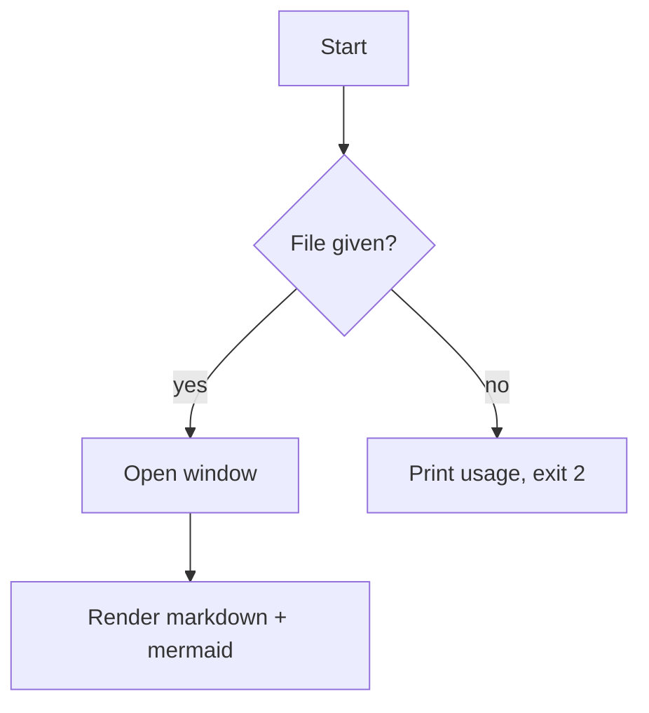
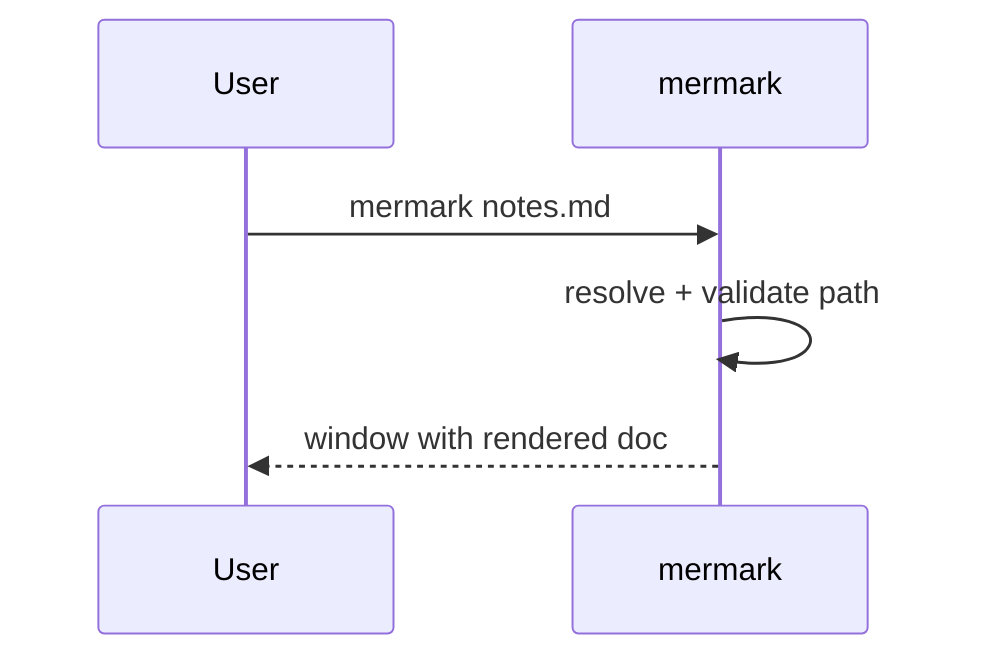

# mermark sample

This document exercises every renderer in **mermark**. Open it with:

```
mermark docs/sample.md
```

## Inline styles

Here is **bold**, _italic_, ~~strikethrough~~, and `inline code`. A [normal link](https://example.com) and a footnote reference[^1].

## GFM table + task list

| Feature   | Status | Notes              |
|-----------|--------|--------------------|
| Markdown  | done   | CommonMark + GFM   |
| Mermaid   | done   | zoom + pan         |
| Math      | done   | KaTeX              |

- [x] render markdown
- [x] render mermaid
- [ ] editing (later)

## Code block (highlighted, not mangled)

```js
const greeting = "hello";
const price = `$5 and $10`; // dollar signs here must NOT become math
console.log(greeting, price);
```

## Mermaid (double-click to zoom, Ctrl/Cmd+wheel zoom, drag to pan)





## Math (KaTeX)

Inline math: $e = mc^2$ and $\sum_{i=1}^{n} i = \frac{n(n+1)}{2}$.

Block math:

$$
\int_0^1 x^2 \, dx = \frac{1}{3}
$$

## Callouts

> [!note] This is a note
> Callouts render as tinted boxes.

> [!warning] Be careful
> Warning callouts use a distinct color.

> [!danger] Danger
> So do danger callouts.

## Images

A local image (place `pic.png` next to this file to see it):


A remote image:


## Wikilinks

Link to an existing note: [[sample]] (resolves to this file — active).

Link to a missing note: [[does-not-exist]] (renders struck-through, not clickable).

Aliased: [[sample|click me]].

---

[^1]: This is the footnote definition. It renders dimmed; the reference above is a superscript.
